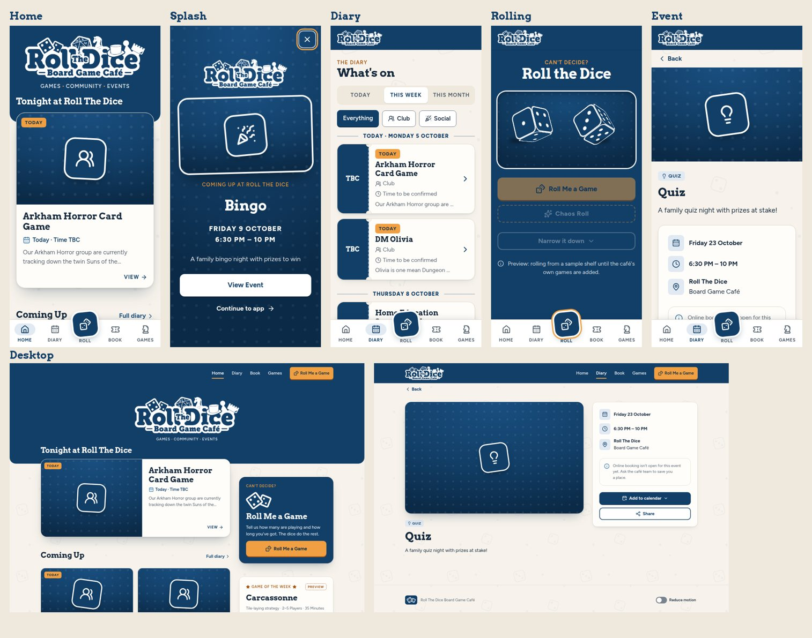

# RTD App Theme

The visual system for the Roll The Dice companion app, built from the café's own logo. Everything below exists in code, and every component is shown live at **`/styleguide`**.

## 1. Brand reference

**Source of truth:** [`docs/brand/RTDLogo.jpg`](brand/RTDLogo.jpg), the image supplied in the brief (Google Drive `RTDLogo.jpg`, 1423×1437, the café's square avatar).

What the reference shows:

| Aspect | Finding |
| --- | --- |
| **Colours** | Two only: brand navy **#123F68** (measured; about 82% of the image) and white. No secondary or accent colour. |
| **Logo treatment** | White die-cut "sticker" lockup on navy. The lettering is navy cut out of white, with an even white outline round everything. Tagline "— Board Game Café —" sits between rules. |
| **Typography** | A heavy, round, geometric slab serif. The closest open font is **Arvo Bold** (compared side by side against Bitter, Roboto Slab, Bree Serif and Rokkitt). |
| **Shape language** | Rounded everything: the sticker outline has soft corners, and the d6 dice are rounded squares tilted at different angles. Nothing sharp. |
| **Borders** | A thick, even white outline (about 1.3% of the logo width), like a vinyl sticker. |
| **Illustration** | Flat, single-colour silhouettes with navy inner lines. No gradients, shading or texture. |
| **Motifs** | Two d6 dice (showing four and two), a d20, a chess knight, a top hat, a pawn and a rook. |
| **Contrast** | Very high: white on navy is 10.8:1. |
| **Personality** | Friendly, chunky, tidy and a little retro. Playful without being childish. |

How the app uses it:
- **Logo:** always on navy, exactly as in the reference. `web/public/brand/rtd-logo.webp` is a white cut-out, so on brand navy it reproduces the original pixel for pixel. Nothing was redrawn.
- **Dice mark:** the two dice cut from the logo, with the same sticker outline restored round them. Used for small places: icons, favicon, footer, staff header.
- **Where the logo appears:** the Home header, the top bar of other screens, the splash, the PWA install and launch screens, the share image, and the Staff Control header. Never inside cards.
- **Rebuilding the assets:** `npm run brand:assets` (Python with Pillow, NumPy and SciPy). Re-run it if the café supplies a higher-resolution or vector logo with the same layout.

## 2. Colours

Defined once in [`web/src/theme/colours.ts`](../web/src/theme/colours.ts) and emitted as CSS variables. The reference has only navy and white. The extra colours come from two places:
- **Derived from the navy:** its tints and shades.
- **RTD's existing poster orange (#D9822B):** brightened so it reads on navy.

| Token | HEX | Use |
| --- | --- | --- |
| `--rtd-primary` | `#123F68` | Logo navy. Headers, primary buttons, selected nav, event stubs |
| `--rtd-primary-light` | `#E1EAF3` | Selected backgrounds, info icons |
| `--rtd-primary-dark` | `#0B2A47` | Pressed states, dice tray, FULL |
| `--rtd-secondary` | `#2F6EA5` | Focus ring, icons, decoration |
| `--rtd-secondary-light` | `#DDEBF7` | NEW and APPROVED chips, info notices |
| `--rtd-secondary-dark` | `#1F5280` | Links |
| `--rtd-accent` | `#F0A043` | Roll buttons, TODAY, Game of the Week stars, focus on navy. Sparingly. |
| `--rtd-accent-hover` | `#E48A24` | Hover on accent |
| `--rtd-accent-strong` | `#A4520C` | Orange as text on light surfaces |
| `--rtd-background` | `#F7F3EC` | Page: warm café paper, not sterile white |
| `--rtd-background-alt` | `#EFE8DC` | Bands, tracks, table headers |
| `--rtd-surface` | `#FFFDF9` | Cards ("card stock") |
| `--rtd-surface-elevated` | `#FFFFFF` | Raised controls, nav bar, menus |
| `--rtd-text` | `#14273B` | Navy ink for reading |
| `--rtd-text-muted` | `#56636F` | Metadata |
| `--rtd-text-inverse` | `#FFFFFF` | Text on navy |
| `--rtd-border` | `#E2DACC` | Decorative card edges |
| `--rtd-border-strong` | `#7A848E` | Form controls and filters (3:1) |
| `--rtd-success` / `-light` | `#1C7A4A` / `#E3F2E9` | BOOKING OPEN, LIVE, confirmed |
| `--rtd-warning` / `-light` | `#9A4F06` / `#FDF0DC` | NEARLY FULL, AWAITING APPROVAL |
| `--rtd-danger` / `-light` | `#B3261E` / `#FBE4E2` | CANCELLED, destructive actions |
| `--rtd-info` / `-light` | `#2F6EA5` / `#DDEBF7` | Information notices |
| `--rtd-event` | `#123F68` | Event identity |
| `--rtd-booking` | `#1C7A4A` | Booking identity |
| `--rtd-game` | `#A4520C` | Game identity (game facts icons) |
| `--rtd-host` | `#4E4A8E` | Host identity: a muted indigo next to the navy |
| `--rtd-focus` / `--rtd-focus-inverse` | `#2F6EA5` / `#F0A043` | Focus rings on light and navy |

**Usage rules:**
- Navy dominates.
- Orange marks the signature Roll action and a few special moments.
- Cards are never each a different colour: every fallback event image is the same navy.

## 3. Typography

Two tiers ([`typography.ts`](../web/src/theme/typography.ts)), self-hosted (no Google Fonts requests):

| Tier | Font | Used for |
| --- | --- | --- |
| Display | **Arvo** 700 | Hero, H1, H2, splash, Roll, Game of the Week, event names on cards and pages |
| Interface | **Figtree** (variable) | Everything else: details, forms, navigation, buttons, host and staff screens |

| Role | Size | Weight |
| --- | --- | --- |
| Hero | 34–56px (fluid) | 700 (Arvo has one bold weight; it covers the brief's 700–800) |
| H1 | 28–40px | 700 |
| H2 | 22–28px | 700 |
| H3 | 19px | 600 |
| Body | 16px | 400 (500 for emphasis) |
| Label | 13px, capitals, 0.08em tracking | 600 |
| Metadata | 14px | 400, muted |
| Button | 16px | 700 |

Staff Control swaps headings to the interface font (`--rtd-heading-font`).

## 4. Spacing, radii, shadows

**Spacing** ([`spacing.ts`](../web/src/theme/spacing.ts)): `--rtd-space-1…8` = 4, 8, 12, 16, 24, 32, 48, 64px.

**Layout:**
- Content: 1120px max, reading text 68ch.
- Gutters: 16px on phones, 32px from tablet up.
- Touch targets: at least 44px.

**Radii** ([`radii.ts`](../web/src/theme/radii.ts)): taken from the sticker outline and rounded-square dice.

| Token | Value | Used on |
| --- | --- | --- |
| `--rtd-radius-sm` | 8px | Chips, inputs, filters |
| `--rtd-radius-button` | 12px | Buttons |
| `--rtd-radius-card` | 16px | Cards, tickets |
| `--rtd-radius-feature` | 22px | Feature cards, splash art, dice tray |
| `--rtd-radius-round` | 999px | Pips and switches only (no pill buttons) |

**Shadows** ([`shadows.ts`](../web/src/theme/shadows.ts)): navy-tinted and soft, never glows.
- `sm`: staff and host cards.
- `card`: the default.
- `feature`: hover and feature cards.
- `float`: the raised Roll button.
- `inset`: inside the dice tray.
- **Sticker outline:** a 3–4px white ring, the logo's die-cut edge. It is used on the Roll nav button, the event-art stickers and the splash art.

## 5. Buttons

| Variant | Look | For |
| --- | --- | --- |
| Primary | Navy, white text, 2px darker "token" edge | Book, Submit, Confirm, Add to calendar |
| Roll | Orange, navy text | Roll Me a Game only |
| Secondary | White, navy outline | View, Edit, Filters, Back, Share |
| Destructive | Red, white text; a quiet red-outline variant too | Cancel booking, Cancel event, Remove. **Never navy or orange.** |
| Inverse / outline-inverse | White or white outline | On navy (splash, Roll page) |
| Chaos | Dashed orange outline, with a die that jiggles now and then | Chaos Roll: mischievous, with no slot machine, money or jackpot imagery |
| Text | No box | Low-emphasis actions ("Continue to app") |

**Behaviour:**
- Pressing moves a button down 2px.
- The Roll die wiggles on hover or focus.
- Disabled buttons are at 50% opacity.
- Sizes are `sm` (36px), default (44px) and `lg` (56px).

## 6. Cards

| Card | Design |
| --- | --- |
| **Event card** | Artwork (16:9) with status chips over it, an Arvo title clamped to 2 lines, a "when" line with a calendar icon, a 2-line description and "VIEW →". The whole card is one link, and lifts 2px on hover. |
| **Feature event** | Same card at a larger size: 3:2 art, with art and text side by side from tablet up. |
| **Diary ticket** | A navy tear-off stub holding the start time ("6:30 PM", or "TBC"), punched notches, and a body with chips, title, category, time range and description. Cancelled tickets turn the stub red and strike through the title. |
| **Event art fallback** | A navy panel with faint pips, and the category icon on a die-cut sticker. The sticker's angle varies by event, like dice that have just landed. Real posters replace it, with a navy gradient keeping chips and titles readable. |
| **Game cards** | The reveal card has an orange "THE DICE HAVE SPOKEN" band (striped for Chaos). Game of the Week has a navy band with orange stars, a "WHY WE PICKED IT" panel and roll-again. Shelf rows show a knight tile. |
| **Promo cards (Home)** | Roll (navy feature card), Game of the Week, Book a session. |

## 7. Status chips

Compact: 24px tall, uppercase, 6px radius.

| Chip | Style | Shown when |
| --- | --- | --- |
| TODAY | Orange fill, the loudest | Event is today and not over |
| TONIGHT | Navy with an orange edge and a moon | Today, starting 5 PM or later |
| BOOKING OPEN | Green tint | Phase 5 |
| NEARLY FULL | Amber tint | Phase 5, from real capacity only |
| FULL | Deep navy | Phase 5 |
| FREE | White with a green outline: positive but quiet | Price set to "Free" |
| NEW | Blue tint | Later |
| CANCELLED | Solid red with an icon | Cancelled occurrence |
| Host: DRAFT, AWAITING APPROVAL, APPROVED, LIVE, FULL, COMPLETED, CANCELLED | Grey, amber, blue, green, navy, outline, red | Phases 6–8 |
| PREVIEW | Dashed orange outline | Sample game data (see §13) |

Only real data produces chips: there are no capacity chips until bookings exist.

## 8. Navigation

| Where | Navigation |
| --- | --- |
| **Phones and tablets (<1024px)** | Bottom bar: **HOME · DIARY · ROLL · BOOK · GAMES**, each an icon with a label. The current tab gets a navy label and a tinted pill. **ROLL** is raised: a tilted navy die-cut sticker with a white outline and floating shadow, and an orange ring when it's the current tab. |
| **Desktop (≥1024px)** | A 72px navy top bar with the logo, text links (orange underline on the current page) and an orange **Roll Me a Game** button. Layouts widen into columns: Home gets a sidebar, the Diary's filters move to a sticky side panel, and the event page gets a sticky details panel. |
| **Top bar** | Navy, logo left. On Home it hides its logo, because the Home header carries the big one. |

Sticky date dividers in the diary sit just under the top bar.

## 9. Motion

[`motion.ts`](../web/src/theme/motion.ts):

| Token | Value | Use |
| --- | --- | --- |
| `--rtd-duration-fast` | 140ms | Presses, hovers, toggles |
| `--rtd-duration-normal` | 220ms | Nav highlight, toasts |
| `--rtd-duration-feature` | 420ms | Splash entrance, card reveal, wiggle |
| `--rtd-duration-dice` | 1500ms | The dice roll |

Easings are `standard`, `exit` and `bounce` (a slight overshoot for reveals).

- **Dice:** two CSS 3D dice, styled like the logo's (navy faces, white pips, white outline). They tumble in from the side of a tray, bounce twice and settle, with a shadow that shrinks while they're in the air.
  - The game is picked from the data first; the dice only reveal it.
  - Each bounce calls `cue()` in `web/src/lib/sound.ts`, a silent hook ready for sound effects.
- **Microinteractions:**
  - Cards lift 2px on hover and press down 1px.
  - Filters rise when selected.
  - The Roll die wiggles.
  - The booking-confirmed tick spins in from a die.
- **Loading:** a die that tumbles through its faces ("Loading what's happening...", "Finding your game..."). There are no generic spinners.

## 10. Customer, host and staff themes

One system, three intensities, switched with `data-surface` (see [`theme/index.ts`](../web/src/theme/index.ts)):

| | Customer (default) | Host (`data-surface="host"`) | Staff (`data-surface="staff"`) |
| --- | --- | --- | --- |
| Tabletop texture | 4.5% | 3% | none |
| Headings | Arvo | Arvo | Figtree |
| Card shadow | card | sm | sm |
| Page | Café paper | Café paper | Flat neutral `#F4F2EE` |
| Character | Artwork, motion, big cards | "RTD backstage": brand, cards, operational numbers | Tables, filters, stats; colour only for state |

The style guide shows a host dashboard ("Welcome back", next session with capacity, your events with statuses) and a Staff Control layout. The staff layout has an **RTD CONTROL** sidebar, stat cards (Today, New bookings, Waitlist, Host approvals) and a bookings table.

## 11. Accessibility decisions

- **Contrast, enforced by tests.** `test/theme.test.ts` checks 24 text pairings at 4.5:1 or better, and borders and focus rings at 3:1. Examples:
  - Body text on paper: 13.7:1.
  - Muted text: 5.6:1.
  - Navy on orange: 6.8:1.
  - White on red: 6.5:1.
  - Orange is never used as text on light surfaces; `accent-strong` (5.0:1) is used instead.
- **Focus.** A 3px ring on everything focusable: blue on light, orange on navy.
- **Keyboard.**
  - A "Skip to content" link is the first Tab stop.
  - Focus moves to the new screen on navigation, and to the result after a roll.
  - Escape closes the splash and menus.
- **Touch targets.** At least 44px. An automated check found no control under 40px.
- **Reduced motion.** The device setting and an in-app **Reduce motion** switch (footer) both collapse every duration to instant. The dice settle immediately, the reveal appears in about 0.1s, and the decorative loops stop.
- **Screen readers.**
  - Landmarks and labelled navs.
  - `aria-current` on the current tab.
  - `aria-pressed` on filters.
  - Live regions for results, loading and toasts.
  - Decorative icons hidden.
  - Ticket stubs hidden, with the time repeated in the text.
- **Readable text.** Body text is 16px. The smallest text is 11px, on bottom-nav labels and booking-step labels, always next to an icon or bar.
- **Honest information.** Capacity shows real numbers only. The waitlist copy says joining "doesn't guarantee a place".

## 12. Responsive behaviour

Mobile-first. Checked with automated screenshots at **320, 375, 430, 768 and 1280px** on every screen, with no horizontal scrolling at any width.
- The carousel becomes a two-column grid from 768px.
- The top navigation replaces the bottom bar at 1024px.
- Home, Diary and Event switch to two-column layouts at 1024px.

## 13. What is real and what is a preview

| Screen | Data |
| --- | --- |
| Home, Diary, Event pages, Splash | **Live**, from the Logic Engine sync |
| Roll Me a Game, Games, Game of the Week | **Preview shelf** of 10 well-known games (`web/src/data/preview-games.ts`), labelled "Preview" on screen. Replaced by the café's own inventory in Phase 4. |
| Book | An honest "online booking is on its way" notice and the next timed events |
| Become a Host | Landing page ("RUN THE TABLE"). The application form arrives in Phase 7. |
| Booking flow, host and staff screens | Designed and shown at `/styleguide`. Built in Phases 5–8. |

## 14. Where things live

| Path | What |
| --- | --- |
| `web/src/theme/` | Tokens: colours, typography, spacing, radii, shadows, motion, breakpoints. `index.ts` emits `virtual:rtd-theme.css`. |
| `web/src/styles/` | `base` (reset, type, texture), `components`, `shell` (navigation, splash), `pages`, `roll`, `surfaces` (host and staff) |
| `web/src/components/` | Brand, Nav, Chips, EventCard, EventArt, Dice, Splash, States, Booking, GameCard, Footer, Toaster |
| `web/public/` | Logo, dice mark, icons, manifest, service worker, `_headers` |
| `scripts/brand-assets.py` | Rebuilds the logo, mark, icons and share image from the reference |
